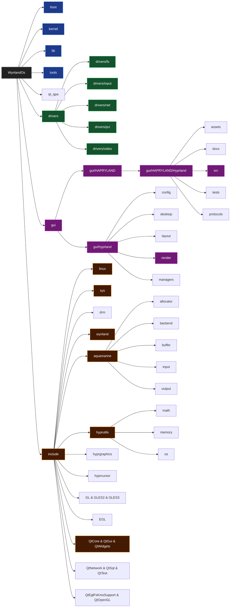

# Архитектура WynlandOS

Ниже представлен граф структуры исходного кода твоей операционной системы (до 3-го уровня вложенности).

```mermaid
graph LR
    Root[WynlandOs] --> boot[boot]
    Root --> kernel[kernel]
    Root --> lib[lib]
    Root --> tools[tools]
    Root --> qt_qpa[qt_qpa]
    
    %% Drivers
    Root --> drivers[drivers]
    drivers --> fs[drivers/fs]
    drivers --> input[drivers/input]
    drivers --> net[drivers/net]
    drivers --> pci[drivers/pci]
    drivers --> video[drivers/video]

    %% GUI / Hyprland
    Root --> gui[gui]
    gui --> HAPRYLAND[gui/HAPRYLAND]
    HAPRYLAND --> Hyprland[gui/HAPRYLAND/Hyprland]
    Hyprland --> H_assets[assets]
    Hyprland --> H_docs[docs]
    Hyprland --> H_src[src]
    Hyprland --> H_tests[tests]
    Hyprland --> H_protocols[protocols]
    
    gui --> hyprland2[gui/hyprland]
    hyprland2 --> h2_config[config]
    hyprland2 --> h2_desktop[desktop]
    hyprland2 --> h2_layout[layout]
    hyprland2 --> h2_render[render]
    hyprland2 --> h2_managers[managers]

    %% Includes (Headers)
    Root --> include[include]
    include --> linux[linux]
    include --> sys[sys]
    include --> drm[drm]
    include --> wynland[wynland]
    
    %% Aquamarine / Graphics libs
    include --> aquamarine[aquamarine]
    aquamarine --> aq_allocator[allocator]
    aquamarine --> aq_backend[backend]
    aquamarine --> aq_buffer[buffer]
    aquamarine --> aq_input[input]
    aquamarine --> aq_output[output]
    
    include --> hyprutils[hyprutils]
    hyprutils --> hu_math[math]
    hyprutils --> hu_memory[memory]
    hyprutils --> hu_os[os]
    
    include --> hyprgraphics[hyprgraphics]
    include --> hyprcursor[hyprcursor]
    
    include --> GL[GL & GLES2 & GLES3]
    include --> egl[EGL]
    
    %% Qt Headers
    include --> qt_core[QtCore & QtGui & QtWidgets]
    include --> qt_net[QtNetwork & QtSql & QtTest]
    include --> qt_egl[QtEglFsKmsSupport & QtOpenGL]
    
    %% Styling
    classDef main fill:#222,stroke:#555,stroke-width:2px,color:#fff
    classDef sys fill:#1e3a8a,stroke:#3b82f6,color:#fff
    classDef driver fill:#14532d,stroke:#22c55e,color:#fff
    classDef gui fill:#701a75,stroke:#d946ef,color:#fff
    classDef header fill:#451a03,stroke:#f59e0b,color:#fff
    
    class Root main
    class boot,kernel,lib,tools sys
    class drivers,fs,input,net,pci,video driver
    class gui,HAPRYLAND,Hyprland,hyprland2,H_src,h2_render gui
    class include,linux,sys,wynland,aquamarine,hyprutils,qt_core header
```
