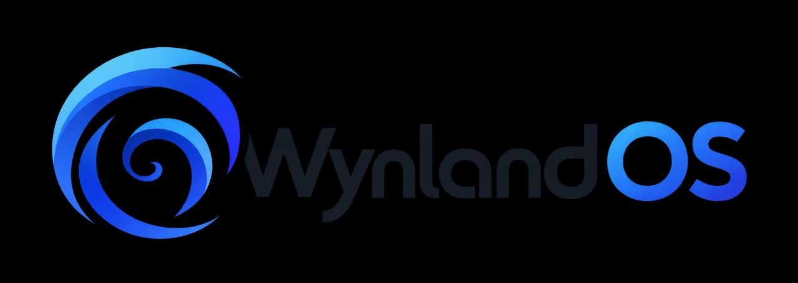

<p align="center">
  
</p>

<p align="center">
  <b>An x86_64 operating system written from scratch</b> — its own UEFI bootloader,
  its own kernel, its own init and its own GPU desktop — that runs real Linux
  software unmodified: WebKit, GStreamer, Qt 6, Python, fish, GNU coreutils.
</p>

---

WynlandOS is not a Linux distribution. There is no Linux kernel underneath:
the **Canopy kernel** is our own, and it speaks the Linux x86_64 syscall ABI
well enough that prebuilt programs from Ubuntu and Debian — glibc and all —
load and run on it as they are. Everything is checked end to end in QEMU by
automatic tests that boot the OS and drive the real programs.

## What it does today

**Desktop — Zerp 2.0.** A tiling window manager written in Qt Quick, drawn on
the GPU (virtio-gpu + virgl → OpenGL ES through Mesa, KMS page flips). Live
frosted glass over the wallpaper, a dock and a bar, transparent windows, and
real client programs in their own processes.

**Wayland and X11.** Zerp 2.0 is a Wayland compositor (xdg-shell, server-side
decorations): Wayland programs from Ubuntu run as tiles beside its own —
the foot terminal comes with the system. X11 programs run through
Xwayland: `xrun xterm`.

**Web — a browser.** WPE WebKit 2.54 (JavaScriptCore with its JIT) in a
Qt Quick shell: Zen-style vertical tabs on live glass, Google search,
HTTPS. YouTube loads and plays video (H.264 via MSE through GStreamer).

**Users and login.** Real accounts (`/etc/passwd`, yescrypt hashes), a
login screen that creates the first account on the first boot, and `ary`:
administrators (the `wheel` group) become root with their own password.

**Shell and tools.** A terminal (libvterm) with fish 4.2 by default, dash
as `/bin/sh`, GNU coreutils, grep, sed, less, find, tar, gzip, xz, ps.

**Packages — leaf.** Installs programs from Ubuntu's archive, signatures
and checksums verified: `leaf install htop`.

**Python 3.14** with the full standard library, `pip` and `venv`: sqlite3,
ssl/HTTPS, asyncio, threads, subprocess, multiprocessing, the interactive REPL.

**Media.** GStreamer 1.28 with Ubuntu's plugins (Vorbis, Opus, H.264/AAC via
libav, VP8/9, AV1); sound through an Intel HD Audio driver (`/dev/dsp`).

**Also:** Qt 6 apps (a file manager), curl, nano, CMake, pkg-config.

## The kernel

- UEFI boot through our own bootloader; GDT/IDT, a 1 kHz timer (PIT),
  XSAVE/AVX state per thread.
- Per-process address spaces with demand paging, copy-on-write `fork()`,
  `vfork`/`posix_spawn`, shared and file-backed `mmap`, a page cache,
  W^X with an opt-in for JITs.
- Threads, futexes, POSIX signals (`SA_SIGINFO`, `SA_RESTART`, masks,
  `sigsuspend`), process groups and sessions, `wait4`/`waitid`.
- ext2 on AHCI with a write-back block cache: symlinks, hard links,
  permissions, a working directory and the `*at()` calls.
- Pseudo-terminals with a real line discipline (`/dev/ptmx`, `/dev/pts/N`,
  canonical mode, ^C to the foreground group, `SIGWINCH`).
- Networking: virtio-net, ARP/IPv4/ICMP/UDP/TCP, DHCP, DNS; Unix domain
  sockets with fd passing; `poll`, `select`, `epoll`, `eventfd`, `timerfd`,
  `memfd`.
- Graphics: a virtio-gpu DRM driver with virgl 3D, GEM buffers, PRIME and
  KMS. Sound: Intel HD Audio.
- **wynrc**, an OpenRC-style init: declarative services, parallel start,
  supervision; the desktop is up a few seconds after boot. Login and
  `su`/`ary` with hashed passwords.

## Build and run

Ubuntu 26.04 (native or WSL2) with KVM:

```bash
./setup.sh          # toolchain, QEMU, OVMF
make                # kernel, bootloader, the disk image with everything staged
make run-gl         # boot it in QEMU with virgl 3D
```

The userland (Qt, WebKit, GStreamer, Python, fish, coreutils) comes from
Ubuntu's and Debian's packages, fetched and staged into the image by
`tools/stage_*.sh`. `WITH_QT6=0`, `WITH_GST=0`, `WITH_WPE=0`, `WITH_BASE=0`
leave parts out.

### Tests

`make run-gl AUTOTEST=1` boots into the test programs instead of the desktop
(`tests/`): process lifecycle (`forktest`), OpenGL on the GPU (`gltest`), KMS
page flips (`kmstest`), sound, the JIT memory policy, GStreamer playback,
WebKit pages including YouTube (`wpetest`), and the shell, coreutils and
Python (`shtest`). `AUTOTEST=sh` runs just the last one.

## Layout

```
boot/          UEFI bootloader
kernel/        the Canopy kernel: memory, scheduler, syscalls, signals,
               ELF loader, PTYs (tty.c), Unix sockets, futexes
drivers/       AHCI + ext2, virtio-net + TCP/IP, virtio-gpu (DRM/virgl),
               HD Audio, PCI, input
apps/zerp2/    Zerp 2.0, the desktop
apps/web/      the browser (WPE WebKit in Qt Quick)
apps/files/    the file manager
apps/wynrc/    the init system
qt_qpa/        Qt's platform plugin for Zerp
tests/         the boot-time test programs
tools/         staging of the userland, toolchain helpers
rootfs/        files copied into the image (services, configs)
```

## Documentation

- [docs/syscalls.md](docs/syscalls.md): the system calls the kernel
  implements, Linux's and our own.
- [CONTRIBUTING.md](CONTRIBUTING.md): how to contribute, and the terms.

## Next

GPU buffers for Wayland clients (linux-dmabuf), each X11 window as a tile
of its own (an X window manager in Zerp), a lock screen, and real hardware:
USB, NVMe, Realtek 2.5GbE.

<p align="center">
  
</p>

## License

Copyright (C) 2026 Red_Artem39

WynlandOS is free software: you can redistribute it and/or modify it under the
terms of the GNU General Public License as published by the Free Software
Foundation, either version 2 of the License, or (at your option) any later
version (GPL-2.0-or-later). It is distributed WITHOUT ANY WARRANTY; see
[LICENSE](LICENSE) for the full text.

Code taken from other projects keeps its own license, kept beside it and in
[.licenses](.licenses).

The wallpapers are photos from Unsplash, credited in
`rootfs/usr/share/wynland/wallpapers/CREDITS`.

Third-party software staged into the disk image (Qt, WebKit, GStreamer,
Python, fish, GNU coreutils and the rest) is not part of this repository and
keeps its own licenses.
